# Complete Results for our Survey on Human Assessment of Attitude Similarity in Argumentation

This repository contains the anonymized survey results we have collected for our research on metrics for calculating the distance between argumentation graphs.

The survey has been conducted with workers from Amazon Mechanical Turk (MTurk) from the US.
Most questions has different scenarios which were randomly assigned to a participant during the survey.
The results file only contains the answers of participants who answered at least 3 of 5 control questions correctly.

The file `results.html` contains each question which has been asked.
The different scenarios (h3 level) or grouped together (h2 level).
The h2 heading contains the exact question which has been asked, followed by the summary of all answers frequencies for this scenario, each scenario's text and answer frequencies.
If multiple questions have been asked for the same scenario, its text is not repeated again.
More complex scenarios include a graphic representing the argumentations; those graphics were not part of the questionnaire.

The answer we have expected from our hypotheses are marked <b>bold</b>.
Significant answer frequencies are underlined in different styles depending on the significance level:

* <u>10 %</u>:  dotted, medium blue
* <u>5 %</u>:  dashed, orange
* <u>1 %</u>:  dark red

Note that only the p-values for our expected answers are valid, as no correction for multiple testing is applied.
Each percentage is followed by the concrete ratio of given answers and Clopper–Pearson confidence intervals for α=0.05. 

## Demographic information

counting only participants who answered at least 3 out of 5 control questions correctly

| Age Group | # |
| ----------| - |
| 20-29  | 25 |
| 30-39  | 25 |
| 40-49  |  2 |
| 50-59  |  6 |
| 60-69  |  2 |
| &gt;69 |  0 |

| Gender | # |
| ------ | - |
| Male   | 53 |
| Female | 27 |
| Rather not say | 0 |

## Mapping of Hypothesis to survey questions

Each question (or question group) has a unique identifier.
The following table shows which questions have been used to support which hypothesis.
For more complex scenarios in the questionnaire, a graphical visualization is included (cf. html for expected answers).

| # | Hypothesis | Question Group | Visualization of Questionnaire Scenario |
| - | ---------- | -------------- | --------------------------------------- |
| 1 | Proportionally bigger overlap of opinions on position results in greater similarity than the absolute number of differences. | D1s |
| 2 | Proportionally bigger overlap on arguments for/against a position results in greater similarity than the absolute number of differences. | D1 | 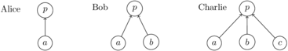
| 3 | A neutral opinion is between a positive and a negative opinion. | D2nf, D2nF |
| 4 | Deviations in deeper parts have less contribution to dissimilarity than deviations in higher parts. | D3 | 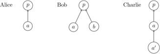
| 5 | Weights of arguments have an influence even if they are the only difference. | D5 |
| 6 | Argumentation differences in a branch with lower importance contribute less to dissimilarity. | D4i | 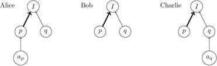
| 7 | No opinion is between a positive and a negative opinion. | D2e, D2eF |
| 8 | An unknown opinion is between a positive and a negative opinion. | D2i, D2iF |
| 9 | A statement for which no opinion is mentioned is like a statement for which we explicitly say the opinion is unknown. | TD2 |
| 10 | Not mentioning an argument and being against an argument have the same effect. | D4e | 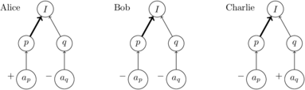
| 11 | Disagreeing on a position results in greater distance than having the same opinion on that position, but with contrary arguments. | Mn | 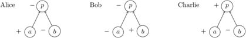
| 12 | It is possible for a difference in arguments for/against positions to result in greater dissimilarity than a difference in opinions on those positions. | Ap | 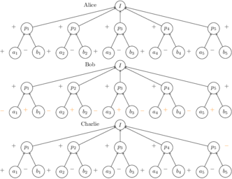
| 13 | Two argumentations with weak and contrary opinions on a statement can be closer than two argumentations with the same opinions, but with very different strength. | D7p, D8 | 
| 14 | Two argumentations with weak arguments and contrary opinions on their premises can be closer than two argumentations with the same opinions, but with very different strength of arguments. | D7a |
| 15 | When determining the attitude regarding a position, opinions (not) mentioned for a not-accepted argument have no influence. | F1 | 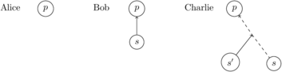
| 16 | Flipping the two important positions results in a bigger difference than flipping two less important positions. | F2s1 | 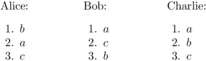
| 17 | Adding a new position can remove a previous dissimilarity. | F2s2 | 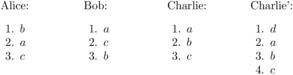
| 18 | Adding a new position as most important position can swap a previous similarity order. | F2a1, F2a2 | 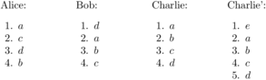
| 19 | Agreeing with someone’s most important position is as important as having that person’s most important opinion matching mine. | Pf | 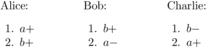
| 20 | Adding another most important position results in greater dissimilarity than flipping the priorities of two positions. | Wa | 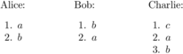
| 21 | Having more similar priorities of opinions can result in greater similarity even with lower absolute number of same opinions. | Wr1 | 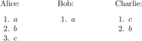
| 22 | Not mentioning a position results in greater dissimilarity than assigning lower priorities. | Pp | 

## Related publication

*will be filled once published*
